# 7. System Architecture and Design

## 7.1 Architectural Overview

### Description of the Overall Architecture

The Intelligent Hospital Management System (HMS) employs a **layered, service-oriented architecture** that cleanly separates concerns across three primary tiers:

| Layer | Description | Key Components |
|-------|-------------|----------------|
| **Presentation Layer** | User interface and user interaction | Streamlit application (`app.py`), reactive UI components (forms, tables, navigation, charts) |
| **Service Layer (Business Logic)** | Domain logic, validation, and orchestration | `PatientService`, `SpecializationService`, `QueueService`, `DoctorService`, `AppointmentService`, `ReportService` |
| **Data Access Layer** | Persistence and database abstraction | `DatabaseManager` (SQLite) / `MySQLDatabaseManager` (MySQL), schema and initialization scripts |

Data flows in one direction: the **Presentation Layer** calls the **Service Layer**; the **Service Layer** uses the **Data Access Layer** to read and write data. Domain entities (e.g. `Patient`, `Doctor`, `Appointment`) are defined in the **Models** (`src/models/`) and are used by both the Service and Data Access layers. The UI does not access the database directly—all persistence goes through the services.

This structure is consistent with a **Layered Architecture** (also referred to as *N-Tier*) combined with a **Service-Oriented** design: each service encapsulates one domain (patients, queue, appointments, etc.) and exposes operations (create, read, update, delete, and domain-specific actions such as “serve next patient” or “check conflicts”).

### Rationale for the Chosen Architecture

- **Separation of concerns:** The UI (Streamlit) is independent of business rules and database technology. Changing the UI framework or the database (e.g. switching from MySQL to SQLite) does not require rewriting business logic.
- **Testability:** Services can be unit-tested by injecting a mock or in-memory database; the presentation layer can be tested against service interfaces.
- **Maintainability:** Each service has a single, well-defined responsibility (e.g. `QueueService` for queue logic, `AppointmentService` for scheduling and conflict detection), making the codebase easier to extend and debug.
- **Reusability:** Business logic lives in services; the same logic can be reused by a different UI (e.g. a REST API or a future mobile app) without duplication.
- **Strategy for data storage:** The system supports both MySQL and SQLite through a single abstract interface (`DatabaseManager`). The concrete implementation (SQLite or MySQL) is chosen at runtime via configuration (`src/config.py`), aligning with the **Strategy Pattern** and enabling portability between production and demonstration environments.

---

## 7.2 Object-Oriented Design

### Key Classes and Responsibilities

**Domain Models (`src/models/`)**  
These classes represent core entities and hold data and simple derived properties. They do not perform database access or business rules.

| Class | Responsibility |
|-------|----------------|
| **Patient** | Represents a patient: identity (ID, name, DOB), contact (phone, email, address), and priority status (Normal, Urgent, Super-Urgent). Exposes `to_dict()` for serialization. |
| **Specialization** | Represents a medical department/specialization: name, description, maximum queue capacity, and active flag. |
| **QueueEntry** | Represents one patient in a queue for a specialization: patient ID, specialization ID, priority, position, join/served/removed timestamps. Exposes computed properties such as `status_text`, `wait_time_minutes`. |
| **Doctor** | Represents a doctor: identity, license number, contact, status (Active, Inactive, On Leave). Exposes `display_name`, `is_active`, and `to_dict()`. Doctor–specialization assignments are stored in a junction table and resolved by `DoctorService`. |
| **Appointment** | Represents an appointment: patient ID, doctor ID, specialization ID, date, time, duration, type (Regular, Follow-up, Emergency), status (Scheduled, Confirmed, Completed, Cancelled, No-Show). Exposes `appointment_datetime` and `end_time` for conflict logic. |

**Data Access (`src/database/`)**  
These classes abstract database operations and connection management.

| Class | Responsibility |
|-------|----------------|
| **DatabaseManager** | SQLite implementation: connection lifecycle, transaction handling, schema initialization, `execute_query`, `execute_update`, backup/restore. Used when `USE_MYSQL` is False. |
| **MySQLDatabaseManager** | MySQL implementation with the same logical interface (connection, execute_query, execute_update, get_last_insert_id). Used when `USE_MYSQL` is True. The application and services depend on the abstract role “database manager,” not a specific class. |

**Services (`src/services/`)**  
These classes implement business logic and use the database manager (and, in one case, other services) to persist and retrieve data.

| Class | Responsibility |
|-------|----------------|
| **PatientService** | CRUD for patients; validation of required fields (e.g. name, DOB); mapping between database rows and `Patient` objects. |
| **SpecializationService** | CRUD for specializations; enforcement of capacity and active/inactive state; used by queue and appointment logic. |
| **QueueService** | Add patient to queue, serve next patient (priority-based ordering), change priority, remove from queue; queue statistics and analytics; enforcement of specialization capacity. |
| **DoctorService** | CRUD for doctors; assignment of doctors to specializations (junction table); used by appointment and report logic. |
| **AppointmentService** | Create/update/complete/cancel appointments; **conflict detection** (same doctor, overlapping time windows); availability checks and doctor calendar; validation of date/time and appointment type. |
| **ReportService** | Aggregation of data for dashboards and reports; uses `DatabaseManager` and instantiates other services to gather patient, queue, doctor, appointment, and specialization statistics; no direct UI—returns data structures for the presentation layer to render. |

**Presentation**  
- **`app.py` (Streamlit)** | Entry point and UI: initializes `DatabaseManager` (or MySQL equivalent) and all services (injecting the same db manager), handles navigation, forms, tables, and charts; calls service methods in response to user actions and displays results. Does not contain business or persistence logic.

### Class Relationships and Interactions

- **Dependency Injection (composition):** Each service receives a `DatabaseManager` (or MySQL implementation) in its constructor. The Streamlit app creates one database manager and injects it into every service. This keeps services decoupled from the concrete database implementation.
- **Models and services:** Services create and return model instances (e.g. `Patient`, `Appointment`). They map database rows to domain objects and vice versa. There is no inheritance among the five model classes; they are independent entities.
- **ReportService and other services:** `ReportService` constructs instances of `PatientService`, `SpecializationService`, `QueueService`, `DoctorService`, and `AppointmentService` internally (each with the same `db_manager`). It then uses these services to aggregate data for reports. No circular dependency: ReportService → other services → DatabaseManager.
- **Foreign key relationships (logical):** `Appointment` references `patient_id`, `doctor_id`, `specialization_id`; `QueueEntry` references `patient_id`, `specialization_id`. Doctor–specialization is many-to-many via `doctor_specializations`. These relationships are enforced in the database and respected by the services when validating and loading data.

### Application of OOP Principles

- **Single Responsibility (SRP):** Each service handles one domain (patients, queue, appointments, etc.). Each model represents one entity. The database manager is responsible only for connection and query execution.
- **Open/Closed (OCP):** New behavior (e.g. a new report type) is added by extending or composing services (e.g. new methods in `ReportService`) or new UI sections in `app.py`, without modifying existing service internals or the database interface. New database backends can be added by providing another implementation of the same logical interface.
- **Dependency Inversion (DIP):** Services depend on an abstract “database manager” (the interface defined by the methods they call: `execute_query`, `execute_update`, `get_connection`, etc.), not on SQLite or MySQL directly. The concrete implementation (SQLite or MySQL) is chosen at startup and injected.
- **Encapsulation:** Business rules (e.g. queue priority algorithm, appointment conflict rules) are encapsulated inside services; the UI and database layers do not duplicate this logic.
- **Composition over inheritance:** The system favors composition (e.g. services “have” a database manager, ReportService “uses” other services) rather than deep inheritance hierarchies.

---

## 7.3 UML Diagrams

The following diagrams are provided in **Mermaid** syntax so they can be rendered in Markdown viewers (e.g. GitHub, GitLab, VS Code with Mermaid support) or exported to images. For submission, you may paste the Mermaid code into a tool such as [Mermaid Live Editor](https://mermaid.live) to generate PNG/SVG and insert the image into your final document.

---

### 7.3.1 UML Class Diagram (Required)

This diagram shows the main domain models, the service layer, the data access abstraction, and their relationships (composition/dependency). The application entry point (`app.py`) is represented as a stakeholder that uses all services.

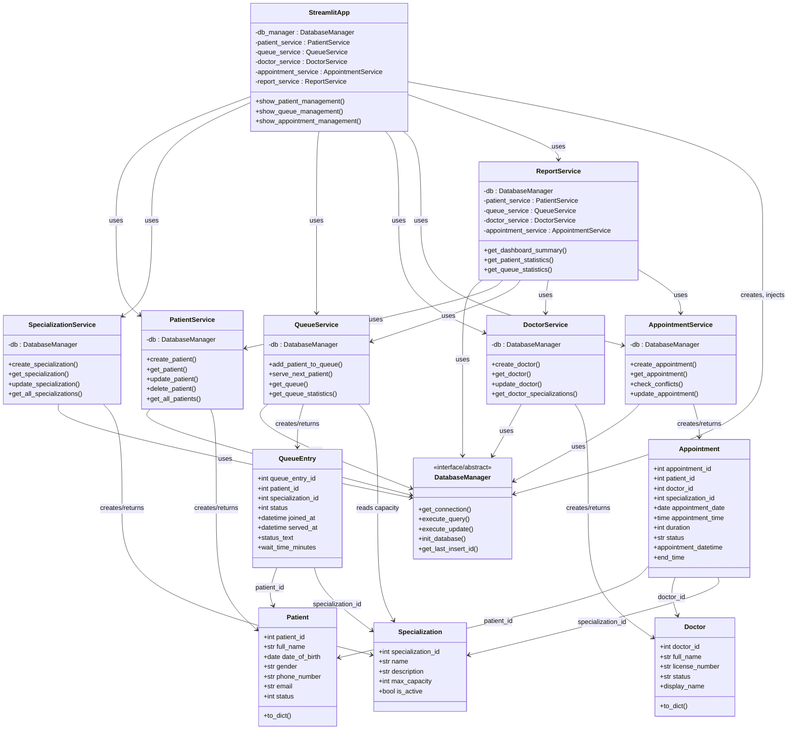

---

### 7.3.2 UML Sequence Diagram (Required)

This sequence diagram illustrates the flow when a **user schedules a new appointment**: from the UI through the service layer and conflict checking to database persistence.

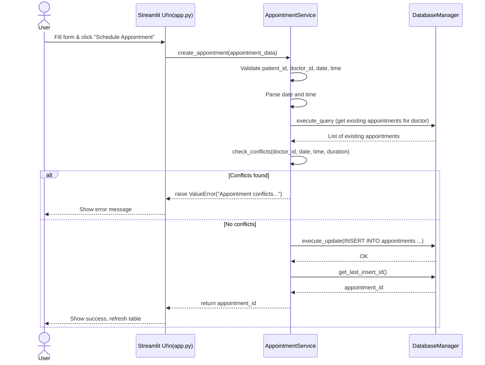

---

### 7.3.3 Activity Diagrams

The following activity diagrams describe user and system actions for the main feature flows. They complement the sequence diagram (7.3.2) and provide a process-view of each module.

---

#### 7.3.3.1 Add Patient to Queue

Describes adding a patient to a specialization queue, including capacity check and priority selection.

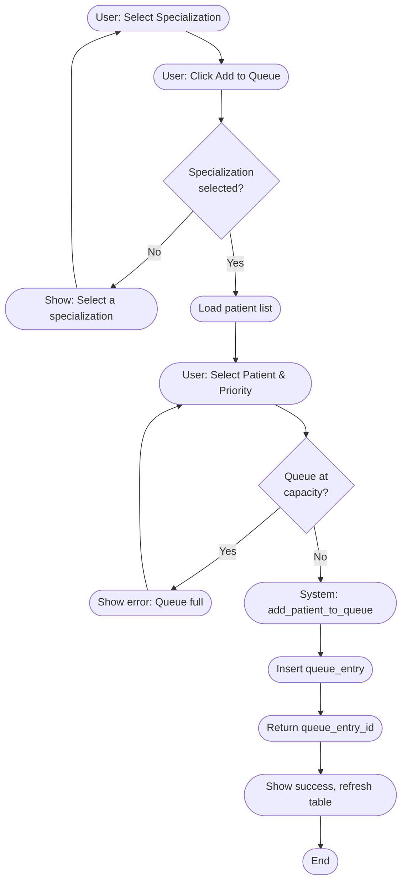

---

#### 7.3.3.2 Patient Registration (Add New Patient)

Describes the flow for registering a new patient: form entry, validation, and persistence.

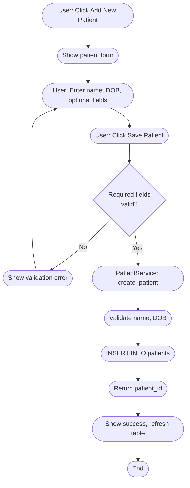

---

#### 7.3.3.3 Edit Patient

Describes selecting a patient, loading the form, updating fields, and saving.

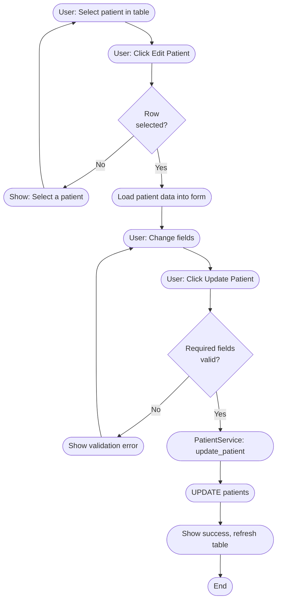

---

#### 7.3.3.4 Delete Patient

Describes selecting a patient, confirming deletion, and removing the record.

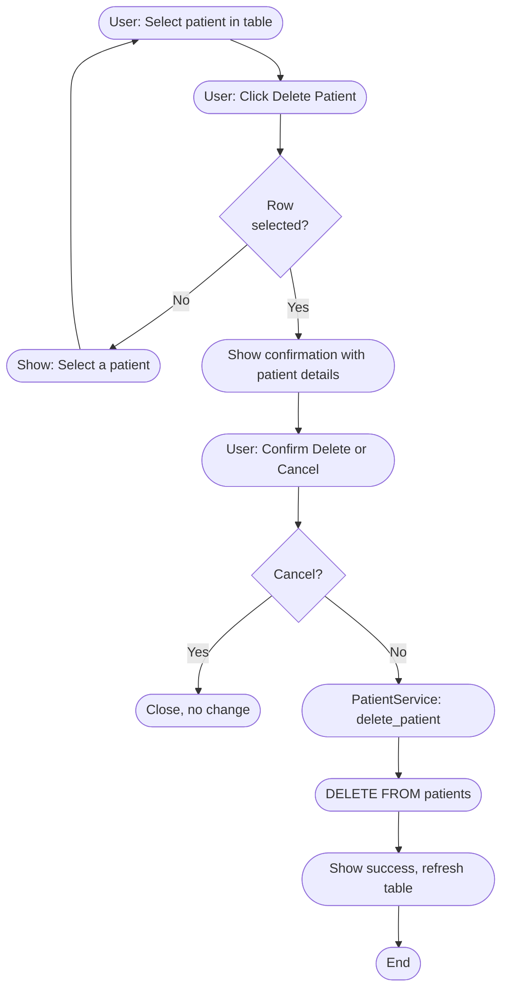

---

#### 7.3.3.5 Doctor Management — Add Doctor

Describes adding a new doctor and assigning specializations.

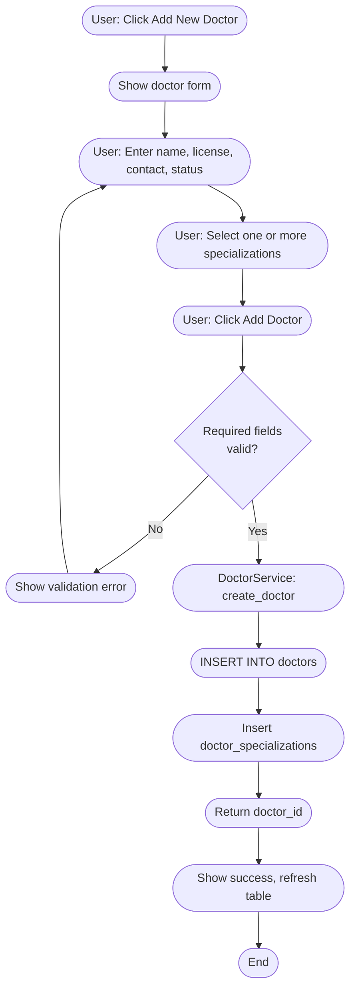

---

#### 7.3.3.6 Doctor Management — Edit Doctor

Describes loading a doctor, updating details and specializations, and saving.

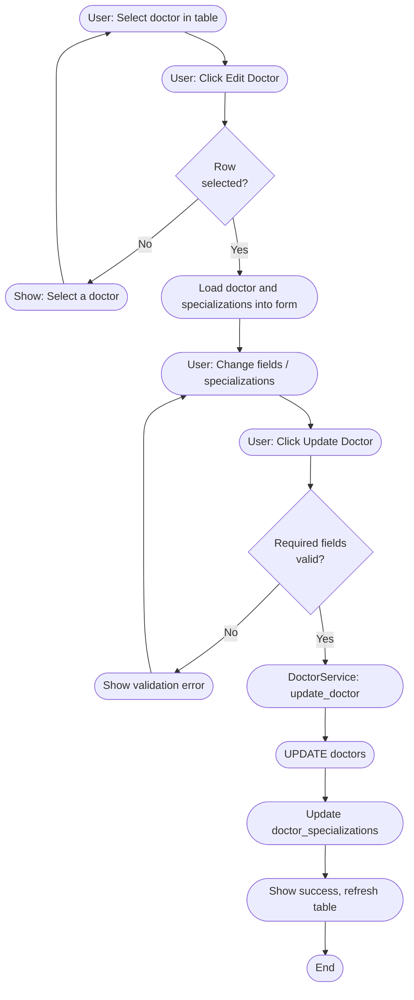

---

#### 7.3.3.7 Doctor Management — Delete Doctor

Describes selecting a doctor, confirming, and removing the record.

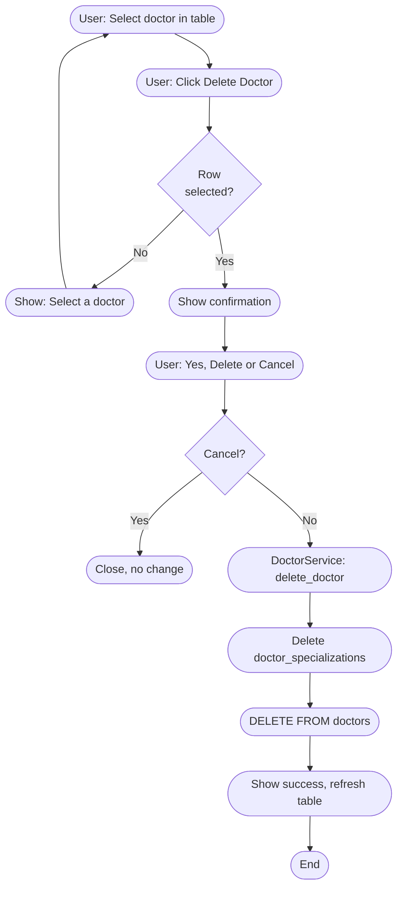

---

#### 7.3.3.8 Specialization Management — Add Specialization

Describes creating a new specialization with name, description, capacity, and active flag.

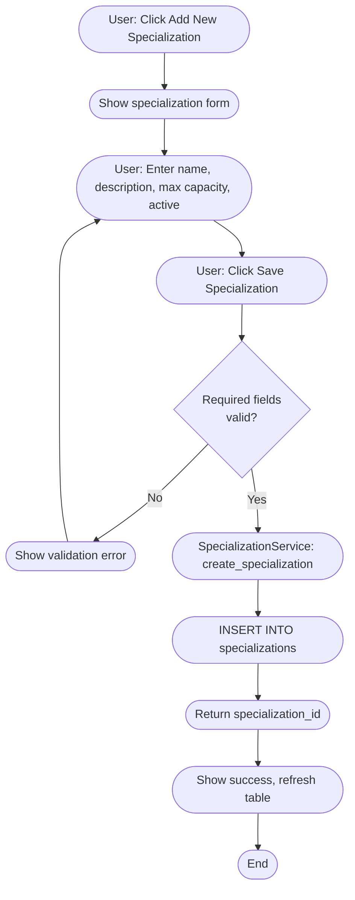

---

#### 7.3.3.9 Specialization Management — Edit / Delete Specialization

Describes editing or deleting a specialization after selection and confirmation.

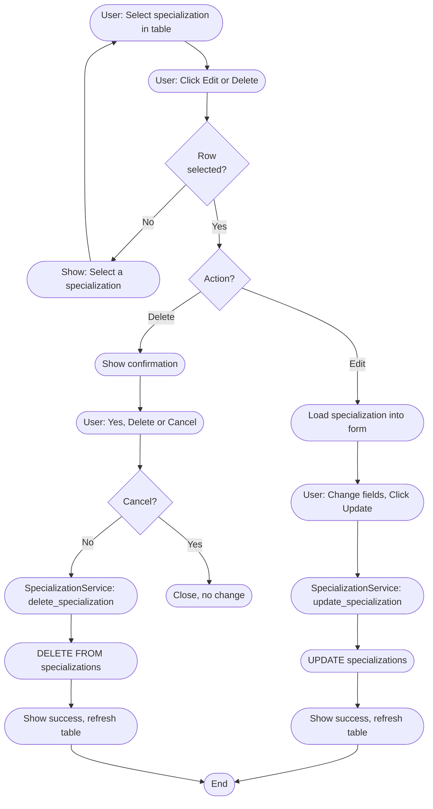

---

#### 7.3.3.10 Schedule New Appointment

Describes the flow for scheduling an appointment: form entry, conflict check, and persistence. Complements the sequence diagram in 7.3.2.

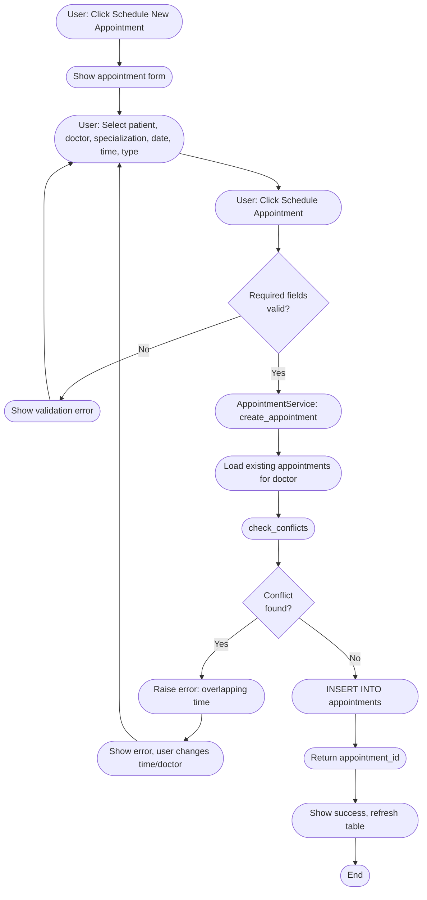

---

#### 7.3.3.11 Serve Next Patient from Queue

Describes serving the next patient in line for a specialization (priority-based).

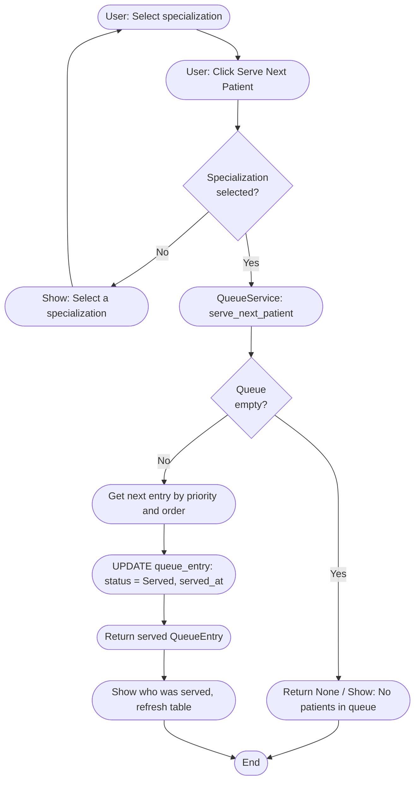

---

#### 7.3.3.12 Report Generation

Describes selecting report type, date range, and generating the report (standard or custom).

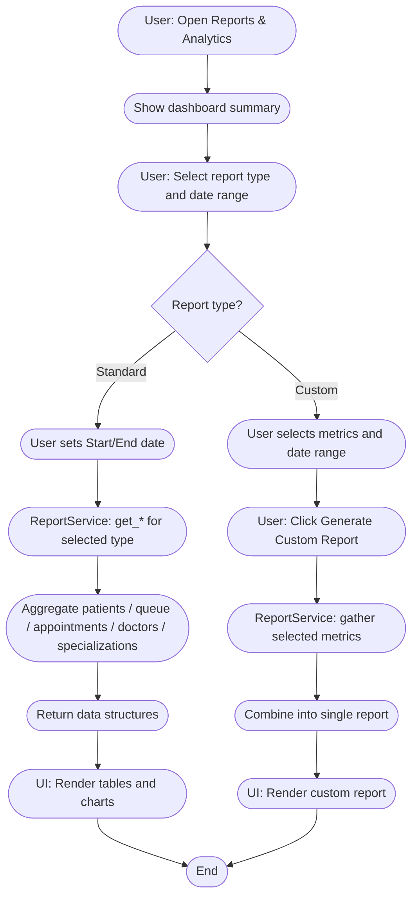

---

### 7.3.4 Additional Diagram: Component Diagram (High-Level)

This component diagram shows the main logical blocks of the system and their dependencies, aligned with the layered, service-oriented design.

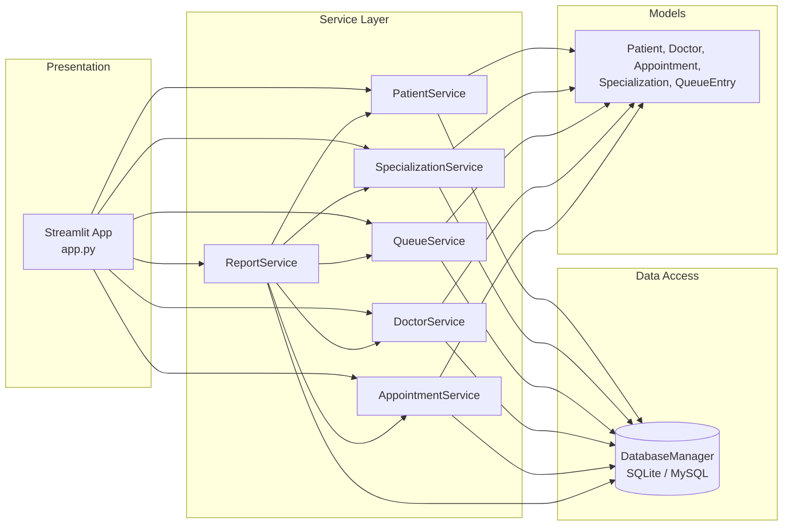

---

**Note for final submission:** Replace the placeholder “(Note: Visual diagrams should be inserted here during final formatting)” in your main document with the content above. For strict UML submission requirements, you may export the Mermaid diagrams to PNG or SVG using [Mermaid Live Editor](https://mermaid.live) or a CI/CD Mermaid step, then reference the resulting figures in Section 7.3.

**Document:** Section 7 — System Architecture and Design  
**Last updated:** January 31, 2026
